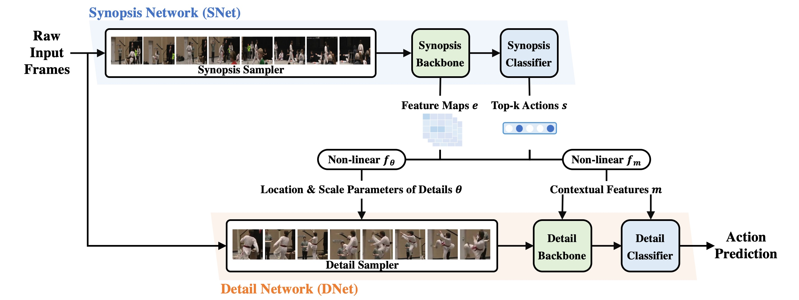

# Delving into Details: Synopsis-to-Detail Networks for Video Recognition (S2DNet)

This repo is the official Pytorch implementation of our paper:
> [Delving into Details: Synopsis-to-Detail Networks for Video Recognition]()  
> Shuxian Liang, Xu Shen, Jianqiang Huang, Xian-Sheng Hua   
> ECCV 2022 Oral   



## Prerequisites

The code is built with following libraries:

- [PyTorch](https://pytorch.org/) 1.10.0 or higher 
- [Torchvision](https://github.com/pytorch/vision)
- [TensorboardX](https://github.com/lanpa/tensorboardX)
- [tqdm](https://github.com/tqdm/tqdm.git)
- [scikit-learn](https://scikit-learn.org/stable/)
- [ffmpeg](https://www.ffmpeg.org/)
- [fvcore](https://github.com/facebookresearch/fvcore)
- Note that the `ops` directory contains the modified base model from [TSM](https://github.com/mit-han-lab/temporal-shift-module). Please prepare the necessary auxiliary codes for the model (e.g., transform.py) according to the original repo.

## Data Preparation

Our work uses [Kinetics](https://www.deepmind.com/open-source/kinetics) and Something-Something V1&V2 for evaluation. We first extract videos into frames for fast reading. Please refer to [TSN](https://github.com/yjxiong/temporal-segment-networks) and [TSM](https://github.com/mit-han-lab/temporal-shift-module) repositories for the detailed guide of data pre-processing.

- Extract frames from videos
- Generate annotations needed for dataloader
- Add the information to [ops/dataset_configs.py](ops/dataset_configs.py)

For Mini-Kinetics dataset used in our paper, you need to use the train/val splits file from [AR-Net](https://github.com/mengyuest/AR-Net).


## Training and Evaluation
(1) To train S2DNet (e.g., on MINI-Kinetics), run
```bash
### Stage1: WARMUP
python s2d_main.py \
    mini-kinetics \
    configs/mini_kinetics/train_warmup.yaml \
    NUM_GPUS 2 \
    TRAIN.BASE_LR 1e-5 \
    TRAIN.BATCH_SIZE 32 \
    SNET.ARCH 'mobilenetv2'

### Stage2: SAMPLING
python s2d_main.py \
    mini-kinetics \
    configs/mini_kinetics/train_sampling.yaml \
    NUM_GPUS 2 \
    TRAIN.RESUME path/to/warmup_ckpt \
    TRAIN.BASE_LR 1e-6 \
    TRAIN.BATCH_SIZE 32 \
    SNET.ARCH 'mobilenetv2'

```

(2) To test S2DNet (e.g., on MINI-Kinetics), run
```bash
python s2d_main.py \
    mini-kinetics \
    configs/mini_kinetics/train_sampling.yaml \
    NUM_GPUS 2 \
    TRAIN.RESUME path/to/test_ckpt \
    TRAIN.BATCH_SIZE 32 \
    SNET.ARCH 'mobilenetv2' \
    EVALUATE True
```

## Acknowledgement
In this project we use parts of the implementations of the following works:
- [TSM](https://github.com/mit-han-lab/temporal-shift-module)
- [SlowFast](https://github.com/facebookresearch/SlowFast)

## Citing
If you find our code or paper useful, please consider citing

    @inproceedings{liang2022delving,
        title={Delving into Details: Synopsis-to-Detail Networks for Video Recognition},
        author={Shuxian Liang, Xu Shen, Jianqiang Huang, Xian-Sheng Hua},
        booktitle={European Conference on Computer Vision},
        year={2022}
    }

